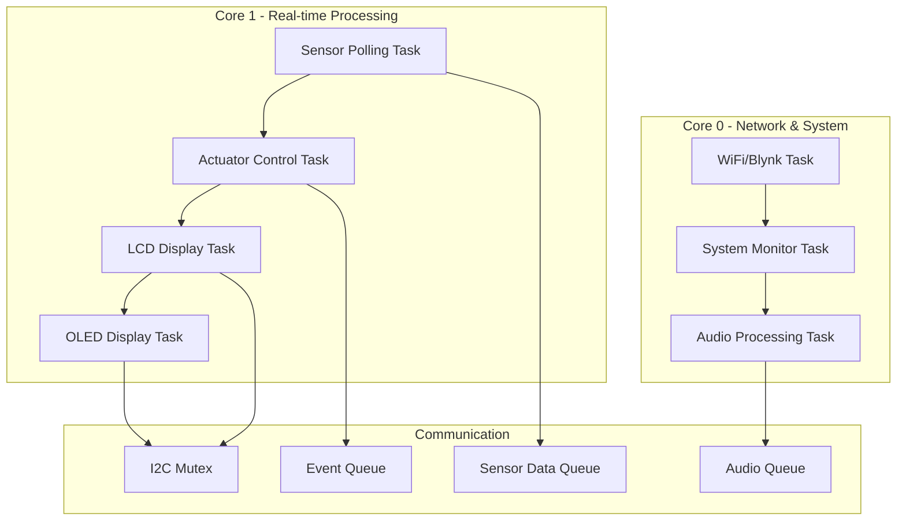

# 🛡️ Smart Shop Guard - Advanced IoT Security System


A comprehensive IoT-based security and automation system for retail environments, featuring real-time monitoring, automated responses, and remote control capabilities through cloud connectivity.

## 🌟 Overview

The Smart Shop Guard is an intelligent security system designed for retail environments, combining multiple sensors, actuators, and cloud connectivity to provide comprehensive monitoring and automated responses. The system uses ESP32 microcontrollers with FreeRTOS for optimal performance and reliability.

### 🎯 Key Features

- **🔥 Fire Detection & Suppression** - Automatic flame detection with relay-controlled suppression system
- **🚶 Motion Detection** - PIR-based intruder detection with day/night modes  
- **🌡️ Climate Control** - Temperature and humidity monitoring with automated fan control
- **🚪 Automated Access** - Ultrasonic sensor-based automatic door control
- **📱 IoT Connectivity** - Real-time monitoring and control via Blynk mobile app
- **🖥️ Dual Display System** - 16x2 LCD and 128x64 OLED displays for comprehensive status information
- **🎵 Audio Alerts** - Intelligent audio notification system for different alert types
- **⚡ FreeRTOS Architecture** - Multi-core task management for optimal performance

## 📁 Project Structure

```
Smart-Shop-Guard-project/
├── 📂 Main_RTOS_ADDED/           # Main implementation with FreeRTOS
│   ├── 📂 src/                   # Source code files
│   ├── 📂 include/               # Header files and configuration
│   ├── 📂 lib/                   # External libraries
│   └── 📄 platformio.ini         # PlatformIO configuration
├── 📂 Smart_Shop_Guard_Arduino/  # Arduino IDE compatible version
├── 📂 OLED_DEMO/                # OLED display demonstration
├── 📂 smart_guard_leds_demo/    # LED effects demonstration
├── 📂 servo_test/               # Servo motor testing utility
└── 📄 README.md                 # This file
```

### 📂 Folder Descriptions

- **`Main_RTOS_ADDED/`** - The primary implementation featuring FreeRTOS multi-tasking architecture for optimal performance and reliability. This version includes advanced task management, dual-core processing, and comprehensive error handling.

- **`Smart_Shop_Guard_Arduino/`** - Arduino IDE compatible single-file implementation for easier development and testing. Contains all functionality in one .ino file for simplified deployment.

- **`OLED_DEMO/`** - Standalone demonstration of the OLED display system with multi-page navigation, button controls, and various display themes.

- **`smart_guard_leds_demo/`** - LED strip effects demonstration showing different lighting patterns for various system states (boot, secure, alert, scan modes).

- **`servo_test/`** - Simple utility for testing servo motor functionality with ultrasonic sensor integration for automatic door control.

## 🔧 Hardware Requirements

### 🖥️ Microcontroller
- **ESP32-S3-WROOM-1 N16R8** (Primary)
  - Dual-core Xtensa LX7 @ 240MHz
  - 16MB Flash Memory, 8MB PSRAM
  - Built-in WiFi & Bluetooth

### 📺 Display Systems
- **16x2 LCD Display (I2C)** - Primary status display
- **1.3" OLED Display (128x64, SH1106)** - Advanced multi-page interface

### 🔍 Sensors
- **DHT11** - Temperature and humidity monitoring
- **Flame Sensor** - Fire detection
- **PIR Motion Sensor** - Intrusion detection  
- **Ultrasonic Sensor (HC-SR04)** - Distance measurement

### ⚡ Actuators & Output
- **Servo Motor** - Automatic door mechanism
- **Relay Module** - Fire suppression system control
- **Piezo Buzzer** - Audio alerts and notifications
- **12V Fan** - Climate control system

## 🚀 Quick Start

### 📋 Prerequisites
- PlatformIO IDE or Arduino IDE with ESP32 support
- ESP32-S3 development board
- Hardware components as listed above
- WiFi network with internet access
- Blynk account for IoT connectivity

### 🛠️ Installation

1. **Clone the Repository**
   ```bash
   git clone https://github.com/your-username/Smart-Shop-Guard-project.git
   cd Smart-Shop-Guard-project
   ```

2. **Configure Credentials**
   ```bash
   cd Main_RTOS_ADDED
   cp credentials_template.h credentials.h
   # Edit credentials.h with your WiFi and Blynk credentials
   ```

3. **Build and Upload**
   ```bash
   # Using PlatformIO
   pio run -t upload
   
   # Or use Arduino IDE with Smart_Shop_Guard_Arduino/Smart_Shop_Guard_Arduino.ino
   ```

4. **Monitor System**
   ```bash
   pio device monitor
   # Baud rate: 115200
   ```

### 📱 Blynk App Setup

1. Create a new project in Blynk app
2. Add widgets for:
   - **V0** - Temperature display
   - **V1** - Humidity display
   - **V3** - Motion detection status
   - **V4** - Fire detection status
   - **V5** - Day/Night mode toggle
   - **V6** - AC control switch

## 🏗️ System Architecture

### 🔄 FreeRTOS Task Structure (Main_RTOS_ADDED)



### 📊 Data Flow

1. **Sensor Reading** - Continuous monitoring of all sensors
2. **Event Processing** - Fire/motion events trigger immediate responses
3. **Display Updates** - Real-time status updates on both displays
4. **Cloud Sync** - Periodic data transmission to Blynk cloud
5. **Audio Alerts** - Context-aware audio notifications

## 🔧 Configuration

### 📌 Pin Assignments (ESP32-S3)

```cpp
// Sensors
#define DHTPIN 40           // DHT11 sensor
#define FLAME_SENSOR_PIN 4  // Flame sensor
#define PIR_PIN 5           // PIR motion sensor
#define TRIG_PIN 42         // Ultrasonic trigger
#define ECHO_PIN 41         // Ultrasonic echo

// Actuators
#define FAN_PIN 12          // Fan control
#define RELAY_PIN 1         // Relay control
#define SERVO_PIN 7         // Servo motor
#define BUZZER_PIN 17       // Buzzer

// Displays (I2C)
// LCD: SDA=21, SCL=22 (default I2C)
// OLED: SDA=8, SCL=9 (custom I2C)
```

### ⚙️ Thresholds & Settings

```cpp
#define TEMP_THRESHOLD 23      // Temperature threshold (°C)
#define HUMIDITY_THRESHOLD 60  // Humidity threshold (%)
#define DISTANCE_THRESHOLD 12  // Door activation distance (cm)
#define SERVO_DELAY 3000      // Door close delay (ms)
```

## 🎮 Operation Modes

### 🌞 Day Mode
- Normal operation with full sensor monitoring
- Motion detection for customer counting
- Automatic door operation
- Climate control active

### 🌙 Night Mode  
- Enhanced security monitoring
- Motion detection triggers theft alerts
- Fire detection with priority response
- Reduced automatic operations

### 🔧 Manual Override
- Remote control via Blynk app
- Emergency stop functions
- System diagnostics and testing

## 📱 Mobile App Features

### 📊 Real-time Monitoring
- Live sensor readings display
- System status indicators
- Alert notifications
- Historical data graphs

### 🎛️ Remote Control
- Day/Night mode switching
- AC system control
- Emergency stop functions
- System configuration

### 🚨 Alert Management
- Push notifications for alerts
- Alert history and logs
- Custom alert thresholds
- Notification preferences

## 🎥 Demonstration Videos

### 🆕 Latest System Demonstration
[Watch Complete System Demo](https://drive.google.com/file/d/1DEiiu3c_jyL2BlM3E3HrjiZbTmpKdn8Q/view?usp=sharing)

*Latest comprehensive demonstration showing the complete Smart Shop Guard system in action with all integrated features.*

---
## OLD
### 🚪 Automatic Entry Detection System
[Watch Video](https://github.com/user-attachments/assets/28712764-492d-467e-9aa7-fb2b8b069abf)

### 🔥 Firefighting System Response
[Watch Video](https://github.com/user-attachments/assets/1052b2f2-3211-4acc-8836-fc73112fbd1a)

### 📺 LCD Alert Display
[Watch Video](https://github.com/user-attachments/assets/c1f41d64-3401-45b4-99e5-8f7c6153e420)

### 🌡️ Climate Control System
[Watch Video](https://github.com/user-attachments/assets/e4350ce7-36f6-45f2-aca9-62d095d811f2)

## 🔧 Troubleshooting

### 🔌 Common Issues

**WiFi Connection Problems**
- Verify credentials in `credentials.h`
- Ensure 2.4GHz network (ESP32 doesn't support 5GHz)
- Check signal strength and router compatibility

**Display Issues**
- Verify I2C connections and addresses
- Check power supply voltage levels
- Ensure proper pull-up resistors

**Sensor Reading Errors**
- Verify pin connections match configuration
- Check sensor power supply
- Test sensors individually using test sketches

### 🐛 Debug Information
- Serial monitor output at 115200 baud
- System diagnostics displayed at startup
- FreeRTOS task stack monitoring
- Memory usage reporting

## 🔮 Future Enhancements

### 📈 Planned Features
- **📷 Camera Integration** - ESP32-CAM module support
- **💾 SD Card Logging** - Local data storage and backup
- **🌐 Web Interface** - Browser-based control panel
- **📧 Email Notifications** - SMTP alert system
- **🗣️ Voice Alerts** - Text-to-speech integration
- **📊 Advanced Analytics** - Usage pattern analysis

### 🔧 Hardware Expansions
- **🔍 Additional Sensors** - Gas, smoke, water leak detection
- **💡 Smart Lighting** - Automated lighting control
- **🔋 Battery Backup** - UPS functionality for power outages
- **📡 LoRa Communication** - Long-range wireless connectivity

## 🤝 Contributing

We welcome contributions! Please feel free to:
- 🐛 Report bugs and issues
- 💡 Suggest new features
- 🔧 Submit pull requests
- 📚 Improve documentation

### 📝 Development Guidelines
- Follow existing code style and conventions
- Add comprehensive comments for new features
- Test thoroughly on actual hardware
- Update documentation for any changes

## 📄 License

This project is open-source and available under the MIT License. See [LICENSE](LICENSE) file for details.

## 🙏 Acknowledgments

- **ESP32 Community** - For excellent development resources
- **Blynk Team** - For the IoT platform
- **Arduino Community** - For libraries and support
- **FreeRTOS** - For the real-time operating system

## 📞 Support

For technical support or questions:
- 📖 Check the troubleshooting section above
- 🔍 Review serial monitor output for diagnostics
- ✅ Verify hardware connections match pin configuration
- ⚡ Ensure power supply meets ESP32-S3 requirements

---

**Smart Shop Guard** - Protecting retail environments with intelligent IoT technology! 🛡️🏪

*Copyright © 2024 Smart Shop Guard Project Team*

