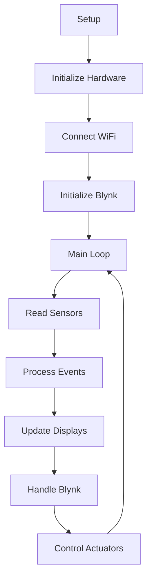

# 🛡️ Smart Shop Guard - Arduino IDE Version

## 📖 Overview

This folder contains the Arduino IDE compatible version of the Smart Shop Guard system. All functionality has been consolidated into a single `.ino` file for easier development, testing, and deployment using the Arduino IDE.

## 🎯 Key Features

- **Single File Implementation** - All code in one `.ino` file for Arduino IDE compatibility
- **Complete Functionality** - Includes all features from the main RTOS version
- **Simplified Deployment** - Easy to upload and test using Arduino IDE
- **Educational Value** - Clear code structure for learning and modification

## 📁 Contents

```
Smart_Shop_Guard_Arduino/
└── Smart_Shop_Guard_Arduino.ino    # Complete system implementation
```

## 🚀 Quick Start

### 📋 Prerequisites

- **Arduino IDE** (version 2.0 or later recommended)
- **ESP32 Board Package** installed in Arduino IDE
- **Required Libraries** (install via Library Manager):
  - WiFi (ESP32 built-in)
  - BlynkSimpleEsp32
  - Wire (built-in)
  - LiquidCrystal_I2C
  - SH1106Wire
  - DHT sensor library
  - ESP32Servo
  - Adafruit_NeoPixel (if using LED strips)

### 🔧 Installation Steps

1. **Open Arduino IDE**
2. **Install ESP32 Support:**
   - Go to File → Preferences
   - Add to Additional Boards Manager URLs:
     ```
     https://dl.espressif.com/dl/package_esp32_index.json
     ```
   - Go to Tools → Board → Boards Manager
   - Search for "ESP32" and install

3. **Install Required Libraries:**
   - Go to Tools → Manage Libraries
   - Install each required library listed above

4. **Configure Credentials:**
   - Open `Smart_Shop_Guard_Arduino.ino`
   - Find the configuration section at the top
   - Replace placeholder values with your credentials:
     ```cpp
     #define BLYNK_TEMPLATE_ID "YOUR_BLYNK_TEMPLATE_ID"
     #define BLYNK_AUTH_TOKEN "YOUR_BLYNK_AUTH_TOKEN"
     #define WIFI_SSID "YOUR_WIFI_SSID"
     #define WIFI_PASSWORD "YOUR_WIFI_PASSWORD"
     ```

5. **Select Board and Port:**
   - Tools → Board → ESP32 → ESP32S3 Dev Module
   - Tools → Port → (select your ESP32 port)

6. **Upload:**
   - Click the Upload button (→)

## ⚙️ Configuration

### 📌 Pin Configuration

The pin assignments are defined at the top of the file:

```cpp
// Pin Definitions
#define DHTPIN 40           // DHT sensor pin
#define FAN_PIN 12          // Fan control pin
#define FLAME_SENSOR_PIN 4  // Flame sensor pin
#define BUZZER_PIN 17       // Buzzer pin
#define RELAY_PIN 1         // Relay pin
#define PIR_PIN 5           // PIR motion sensor pin
#define SERVO_PIN 7         // Servo motor pin
#define TRIG_PIN 42         // Ultrasonic sensor trigger pin
#define ECHO_PIN 41         // Ultrasonic sensor echo pin
```

### 🎛️ System Parameters

```cpp
// Temperature and Humidity Thresholds
#define TEMP_THRESHOLD 23      // Temperature threshold in Celsius
#define HUMIDITY_THRESHOLD 60  // Humidity threshold in percentage

// Ultrasonic Sensor Configuration
#define DISTANCE_THRESHOLD 12  // Distance threshold in cm
#define SERVO_DELAY 3000      // Servo return delay in milliseconds
```

## 🔍 Code Structure

The Arduino version maintains the same functionality as the RTOS version but uses a traditional Arduino loop structure:

### 📋 Main Sections

1. **Configuration & Includes** - All libraries and pin definitions
2. **Global Variables** - System state variables and objects
3. **Setup Function** - Hardware initialization and WiFi connection
4. **Loop Function** - Main program execution cycle
5. **Sensor Functions** - Reading and processing sensor data
6. **Actuator Functions** - Controlling outputs (servo, fan, relay)
7. **Display Functions** - LCD and OLED display management
8. **Blynk Functions** - IoT connectivity and remote control
9. **Utility Functions** - Helper functions and audio alerts

### 🔄 Execution Flow



## 🛠️ Differences from RTOS Version

| Feature | Arduino Version | RTOS Version |
|---------|----------------|--------------|
| **Task Management** | Single loop | Multi-core FreeRTOS tasks |
| **Performance** | Sequential processing | Parallel processing |
| **Complexity** | Simpler structure | Advanced architecture |
| **Resource Usage** | Basic | Optimized with mutexes |
| **Real-time Response** | Good | Excellent |
| **Development** | Easier debugging | Professional grade |

## 🔧 Customization

### 🎨 Adding New Features

1. **New Sensors:**
   - Add pin definitions at the top
   - Create reading functions
   - Add to main loop

2. **Additional Displays:**
   - Include required libraries
   - Initialize in setup()
   - Add update functions

3. **IoT Integration:**
   - Add new Blynk virtual pins
   - Create corresponding functions
   - Update mobile app widgets

### 🔍 Debugging

- **Serial Monitor:** Use 115200 baud rate
- **Debug Prints:** Comprehensive logging throughout code
- **LED Indicators:** Visual feedback for system states
- **Blynk Console:** Remote monitoring and control

## 📱 Blynk Integration

### 🎛️ Virtual Pins

- **V0** - Temperature reading
- **V1** - Humidity reading
- **V3** - Motion detection status
- **V4** - Fire detection status
- **V5** - Day/Night mode toggle
- **V6** - AC control

### 📲 Mobile App Setup

1. Create new Blynk project
2. Add widgets for each virtual pin
3. Configure notification settings
4. Test remote control functionality

## 🚨 Troubleshooting

### ❌ Common Issues

**Compilation Errors:**
- Verify all libraries are installed
- Check board selection (ESP32S3 Dev Module)
- Ensure correct ESP32 board package version

**Upload Failures:**
- Check cable connection
- Verify correct COM port selection
- Try different USB cables
- Press and hold BOOT button during upload if needed

**WiFi Connection Issues:**
- Verify SSID and password
- Check 2.4GHz network (ESP32 doesn't support 5GHz)
- Monitor serial output for connection status

**Sensor Issues:**
- Verify pin connections
- Check power supply (3.3V/5V requirements)
- Test sensors individually

## 📈 Performance Tips

- **Loop Optimization:** Avoid blocking delays in main loop
- **Memory Management:** Monitor heap usage via serial output
- **Display Updates:** Limit update frequency to reduce flicker
- **Network Efficiency:** Batch Blynk updates to reduce traffic

## 🔄 Migration to RTOS Version

To upgrade to the full RTOS version:

1. Use the code as reference for pin assignments
2. Copy your custom modifications
3. Follow the RTOS version setup instructions
4. Test functionality incrementally

## 📞 Support

For issues specific to the Arduino version:
- Check serial monitor output at 115200 baud
- Verify library versions and compatibility
- Test with minimal code first
- Compare with working RTOS version if available

---

This Arduino IDE version provides an excellent starting point for learning and development while maintaining full system functionality. For production deployments or advanced features, consider migrating to the RTOS version.
